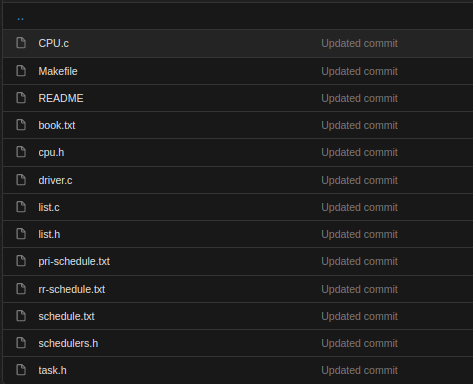
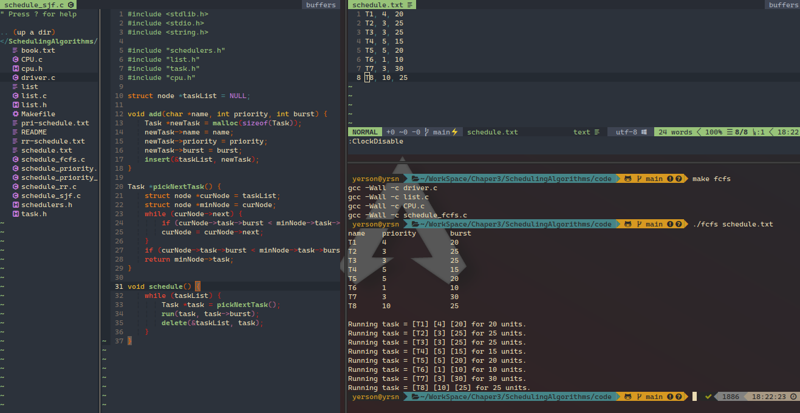

# Scheduling Algorithms

## Proyecto

> El proyecto implica implemetar varios algoritmos vistos en clase estos son:
>
> 1. Primero en llegar, primero en ser atendido (FCFS) First-come, first-served , que programa las tareas en el orden en que solicitan la CPU.
> 2. El trabajo más corto primero (SJF)Shortest-job-first , que programa las tareas en orden de la duración de la siguiente ráfaga de CPU de las tareas.
> 3. Programación prioritaria, que programa tareas en función de la prioridad.
> 4. Programación por turnos (RR) Round-robin, donde cada tarea se ejecuta durante un cuanto de tiempo (o durante el resto de su ráfaga de CPU).
> 5. Prioridad con round-robin, que programa las tareas en orden de prioridad y utiliza la programación por round-robin para las tareas con la misma prioridad.

## Los programas a modificar

## Archivos proporcionados


usamos make para compilar los archivos

```bash
make fcfs
./fcfs schedule.txt
```

# Ejecuciones

### First Come First Service(FCFS)



### Shortest Job First(sjf)


### Priority


### rr


### priority_rr


